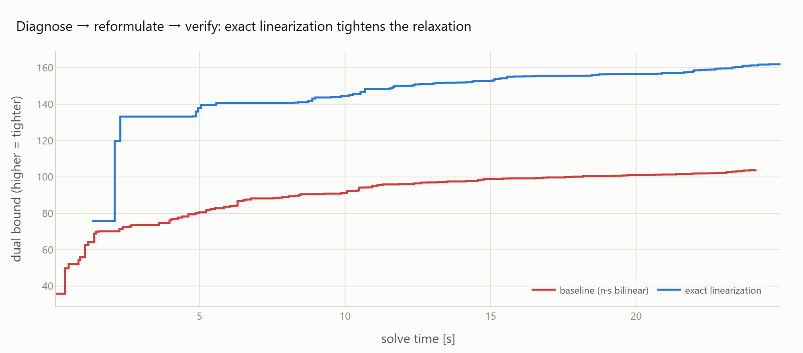

<div align="center">

# minlpkit

**PySCIPOpt(SCIP)で解くMINLPを、観測し・診断し・直し方を提案するツールキット。**

[](https://github.com/ctenopoma/minlpkit/actions/workflows/docs.yml)
[](https://ctenopoma.github.io/minlpkit/)
[](https://www.python.org/)
[](https://github.com/scipopt/PySCIPOpt)
[](LICENSE)

[ドキュメント](https://ctenopoma.github.io/minlpkit/) &nbsp;·&nbsp; [チュートリアル (Colab)](https://colab.research.google.com/github/ctenopoma/minlpkit/blob/main/notebooks/quickstart.ipynb) &nbsp;·&nbsp; [ギャラリー](https://ctenopoma.github.io/minlpkit/gallery.html)

</div>



混合整数非線形計画(MINLP)の求解を、**観測 → 診断 → 改善 → 検証**の一連の流れで支援します。
求解プロセスから症状を観測し、診断ルールで効く改善を推薦し、再定式化ヘルパーやアルゴリズムフレームワークで
手を入れ、before/after を定量比較する。ここまでを 1 つのライブラリで通します。
推薦するのは SCIP が自動ではやらない改善だけ ── 非凸緩和の弱さを突く定式化の作り込みに集中します。

## Features

- **観測 + 診断 (`analyze`)** — 双対境界の停滞・空間分枝の偏り・非線形制約の違反・係数スケール・対称性などを収集し、発火した症状を重要度順に返す
- **再定式化ヘルパー** — 整数×連続の積を厳密線形化する `linearize_product`、Big-M 不要の区分線形近似 `pwl_sos2` など、非凸緩和を締める部品
- **アルゴリズムフレームワーク** — ベンダーズ分解・列生成・branch-and-price をモデル非依存のドライバとして提供
- **before/after 検証 (`compare_variants`)** — ルート双対境界・最終 gap・ノード数を並べ、改善の効果を定量比較
- **ライブモニタ (`minlpkit[viz]`)** — 求解中の双対境界・primal・gap をブラウザへライブ配信(TensorBoard 型、run 比較対応)
- **自動チューニング (`minlpkit[tune]`)** — Optuna で SCIP パラメータを探索

## Installation

```powershell
uv add minlpkit                 # コア (pyscipopt / pandas / numpy / scipy)
uv add "minlpkit[viz,tune]"     # + ライブモニタ / Optuna チューニング
```

## Quickstart

```python
import minlpkit as mk
from pyscipopt import Model

def baseline():   # n·s >= 12 を双線形のまま(McCormick 緩和)
    m = Model(); m.hideOutput()
    n = m.addVar(vtype="I", lb=1, ub=3, name="n")
    s = m.addVar(lb=0.0, ub=10.0, name="s")
    m.addCons(n * s >= 12); m.setObjective(n + s, "minimize")
    return m

def improved():   # 整数×連続の積を厳密線形化
    m = Model(); m.hideOutput()
    n = m.addVar(vtype="I", lb=1, ub=3, name="n")
    s = m.addVar(lb=0.0, ub=10.0, name="s")
    ns = mk.linearize_product(m, n, s, 1, 3, 0.0, 10.0, "ns")
    m.addCons(ns >= 12); m.setObjective(n + s, "minimize")
    return m

print(mk.analyze(baseline, name="baseline", time_limit=5).summary())
df = mk.compare_variants({"baseline": baseline, "improved": improved}, time_limit=5)
print(df[["variant", "root_dual", "final_dual", "final_gap", "nodes"]].to_string(index=False))
```

`analyze` は観測量と発火した診断を要約し、`compare_variants` は 2 つの定式化のルート境界・最終 gap・ノード数を
表で並べます。厳密線形化は最適値を変えずに緩和を締める変換で、規模のある問題ではルート双対境界と探索コストの差として
現れます(上のヒーロー図がその一例)。

## Documentation

| | |
| --- | --- |
| [利用マニュアル](https://ctenopoma.github.io/minlpkit/manual.html) | インストール・ワークフロー・診断ルール表・落とし穴 |
| [API リファレンス](https://ctenopoma.github.io/minlpkit/api/pipeline.html) | docstring から自動生成 |
| [チュートリアル (Colab)](https://colab.research.google.com/github/ctenopoma/minlpkit/blob/main/notebooks/quickstart.ipynb) | 小さな MINLP を定義し `analyze` → `linearize_product` → `compare_variants` を実行 |
| [ギャラリー](https://ctenopoma.github.io/minlpkit/gallery.html) | ダッシュボード・診断・比較結果の HTML 集 |

## Development

```powershell
uv sync                     # 開発依存(pytest / mkdocs / extras)込みでセットアップ
uv run pytest               # テスト(実 SCIP で実行)
uv run mkdocs serve         # ドキュメントをローカルプレビュー
```
