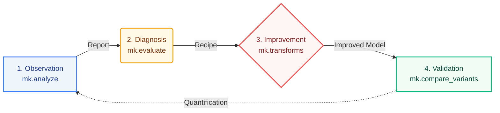

<p align="center">
  
</p>

# minlpkit

A toolkit that integrates **Visualization → Diagnosis → Improvement → Validation** for MINLP (Mixed-Integer Nonlinear Programming) on PySCIPOpt (SCIP).



The design philosophy is **SCIP-aware**. It excludes from recommendations the items that modern SCIP handles automatically, such as presolve / separation / symmetry handling / reduced cost fixing. The diagnoses only recommend formulation elaborations that are effective for weak non-convex relaxations and are not automated by SCIP, such as "exact linearization exploiting integer structure" and "decomposition (Benders / Column Generation)" (based on actual measurements in [FINDINGS.md](https://github.com/ctenopoma/minlpkit/blob/main/FINDINGS.md)).

The [Method Guide (Symptoms → Countermeasures)](playbook/index.md) is a guide that allows you to directly reach the appropriate countermeasures from frequently occurring symptoms in practice, such as "gap not shrinking" or "model too huge to build."

## Quick Start

```powershell
uv sync
$env:PYTHONIOENCODING = 'utf-8'
uv run python demo.py                 # End-to-end demo of visualization → diagnosis → improvement → re-validation
uv run python -m minlpkit.live.server # Live Monitor + Results Gallery (http://127.0.0.1:5000)
```

## Documentation

- [Method Guide (Symptoms → Countermeasures)](playbook/index.md) — Guide to trace from symptoms to methods
- [User Manual](manual/index.md) — Installation, workflow, diagnostic rules table, pitfalls
- [Quick Start](notebooks/quickstart.ipynb) — Tutorial notebook with execution results
- [API Reference](api/pipeline.md) — Function reference for pipelines, comparisons, reformulations, and frameworks
- [Results Gallery](gallery.md) — HTML collection of dashboards, diagnoses, and improvement validations
- [Sample Catalog](samples/index.md) — List of 129 bundled models by category

## Core APIs (1-line Summary)

| API | Role |
| --- | --- |
| `mk.analyze(build_fn, ...)` | Collect observations + diagnose → `Report` |
| `mk.compare_variants({name: build_fn})` | Compare before/after improvements (root dual bound, gap, nodes) |
| `mk.linearize_product(m, y, x, ...)` | Exact linearization of integer × continuous products |
| `mk.pwl_sos2(m, x, brks, vals)` | Piecewise linear approximation of a 1-variable function using SOS2 (no Big-M) |
| `mk.benders(master_build, subproblem_solve)` | Benders decomposition (callback approach) |
| `mk.column_generation(rhs, init_cols, pricing_fn)` | Column generation (Gilmore-Gomory / Wentges stabilization) |
| `mk.price_and_branch(...)` | Column generation + integer master problem (branch-and-price, upper bound) |