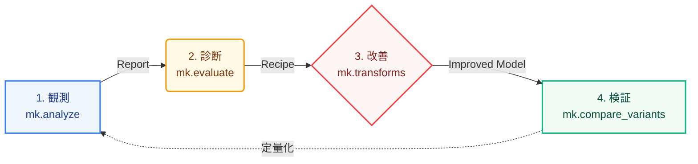

<p align="center">
  
</p>

# minlpkit

MINLP(混合整数非線形計画)の **可視化 → 診断 → 改善 → 検証** を PySCIPOpt(SCIP)上で
一体化したツールキット。



設計思想は **SCIP-aware**。現代の SCIP が presolve / 分離 / 対称性処理 / 被約コスト固定などで
自動処理する事項は推薦対象から外す。診断が推薦するのは、SCIP が自動化しない
「整数構造を突いた厳密線形化」「分解(ベンダーズ / 列生成)」など、非凸緩和の弱さに効く
定式化の作り込みに限られる(根拠は [FINDINGS.md](https://github.com/ctenopoma/minlpkit/blob/main/FINDINGS.md) の実測値)。

[手法ガイド(症状→打ち手)](playbook/index.md) は、「gapが縮まらない」「モデルが巨大で作れない」
といった実務で頻出する症状から、該当する打ち手へ直接到達できるガイドである。

## クイックスタート

```powershell
uv sync
$env:PYTHONIOENCODING = 'utf-8'
uv run python demo.py                 # 可視化→診断→改善→再検証の一気通貫デモ
uv run python -m minlpkit.live.server # ライブモニタ + 成果ギャラリー (http://127.0.0.1:5000)
```

**ライブ監視**は TensorBoard 型の書き手/読み手分離。自分の求解を計器化する側(書き手)は
`solve_with_monitor` に `RunLogger` を渡すだけで、上の `server`(読み手)がブラウザへライブ push する:

```python
from minlpkit.live import solve_with_monitor, RunLogger, new_run_id   # 要 minlpkit[viz]

logger = RunLogger(new_run_id("plant"), meta={"model": "plant"})
mon, summary = solve_with_monitor(model, time_limit=30, logger=logger)  # 求解しつつ run へ追記
# 別ターミナルで `python -m minlpkit.live.server` を起動 → http://127.0.0.1:5000 でライブ表示
```

何ができて・どのコマンドで試せるかの全体像は [機能マップ](manual/capabilities.md) を参照。

## ドキュメント

- [機能マップ(できること一覧)](manual/capabilities.md) — 何ができて・どのAPIで・どのコマンドで試せて・何が出るか
- [手法ガイド(症状→打ち手)](playbook/index.md) — 症状から手法へ辿るガイド
- [利用マニュアル](manual/index.md) — インストール・ワークフロー・診断ルール表・落とし穴
- [クイックスタート](notebooks/quickstart.ipynb) — 実行結果込みのチュートリアルnotebook
- [APIリファレンス](api/pipeline.md) — パイプライン・比較・各種再定式化・フレームワークの関数リファレンス
- [成果ギャラリー](gallery.md) — ダッシュボード・診断・改善検証のHTML集
- [サンプルカタログ](samples/index.md) — 同梱129本をカテゴリ別に一覧

## 主要 API(1行サマリ)

| API | 役割 |
| --- | --- |
| `mk.analyze(build_fn, ...)` | 観測量収集 + 診断 → `Report` |
| `mk.compare_variants({名前: build_fn})` | 改善の before/after 比較(ルート双対境界・gap・ノード) |
| `mk.diagnose_infeasibility(build_fn)` | 実行不可能の犯人特定(弾性緩和=緩める必要量 + 削除フィルタ=IIS核) |
| `mk.linearize_product(m, y, x, ...)` | 整数×連続の積を厳密線形化 |
| `mk.pwl_sos2(m, x, brks, vals)` | 1変数関数を SOS2 で区分線形近似(Big-M不要) |
| `mk.benders(master_build, subproblem_solve)` | ベンダーズ分解(コールバック方式) |
| `mk.column_generation(rhs, init_cols, pricing_fn)` | 列生成(Gilmore-Gomory / Wentges安定化) |
| `mk.price_and_branch(...)` | 列生成 + 整数主問題(branch-and-price、上界) |
| `mk.live.solve_with_monitor(model, logger=...)` | 求解を計器化しrunへ追記(ライブ監視の書き手、要 `viz`) |
| `mk.sweep(build_fn, param_sets)` / `mk.rerun(build_fn, run_id)` | パラメータスイープ / run再現(要 `viz`) |
| `mk.tune(n_trials, time_limit)` | SCIPパラメータの Optuna 探索(要 `tune`) |
| `mk.cuopt_warmstart(model, ...)` / `mk.cuopt_concurrent(model, ...)` | cuOpt(GPU)の解をSCIPへwarm start(要 WSL2/GPU) |

APIと試すコマンド・出力の対応は [機能マップ](manual/capabilities.md) に一覧がある。
