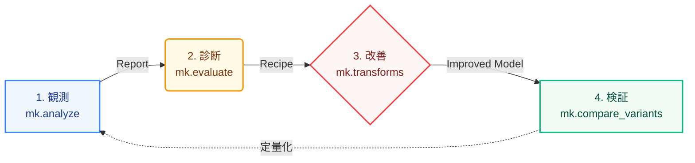

<p align="center">
  
</p>

# minlpkit

MINLP(混合整数非線形計画)の **可視化 → 診断 → 改善 → 検証** を PySCIPOpt(SCIP)上で
一体化したツールキット。



設計思想は **SCIP-aware**: 現代の SCIP が presolve / 分離 / 対称性処理 / 被約コスト固定などで
**自動でやってしまうこと**は推薦しない。診断が推すのは、SCIP が自動ではやらない
「整数構造を突いた厳密線形化」「分解(ベンダーズ/列生成)」など、非凸緩和の弱さに効く
定式化の作り込みだけである(根拠は [FINDINGS.md](https://github.com/ctenopoma/minlpkit/blob/main/FINDINGS.md) の実測値)。

> **モデリングはできるが、列生成・ベンダーズ・再定式化などの手法は知らない?**
> [プレイブック(症状→打ち手)](playbook.md) から入るのが近道。「gapが縮まらない」
> 「モデルが巨大で作れない」など、実務で遭遇しやすい症状から該当する打ち手に直接ジャンプできる。

## クイックスタート

```powershell
uv sync
$env:PYTHONIOENCODING = 'utf-8'
uv run python demo.py                 # 可視化→診断→改善→再検証の一気通貫デモ
uv run python -m minlpkit.live.server # ライブモニタ + 成果ギャラリー (http://127.0.0.1:5000)
```

## ドキュメント

- [利用マニュアル](manual.md) — インストール・ワークフロー・API・ライブモニタ・診断ルール表・落とし穴
- [試してみる](notebooks/quickstart.ipynb) — 実行結果込みのチュートリアルnotebook
- [APIリファレンス](api/pipeline.md) — パイプライン・比較・各種再定式化・フレームワークなどの関数リファレンス
- [成果ギャラリー](gallery.md) — ダッシュボード・診断・改善検証のHTML集

## 主要 API(1行サマリ)

| API | 役割 |
| --- | --- |
| `mk.analyze(build_fn, ...)` | 観測量収集 + 診断 → `Report` |
| `mk.compare_variants({名前: build_fn})` | 改善の before/after 比較(ルート双対境界・gap・ノード) |
| `mk.linearize_product(m, y, x, ...)` | 整数×連続の積を厳密線形化 |
| `mk.pwl_sos2(m, x, brks, vals)` | 1変数関数を SOS2 で区分線形近似(Big-M不要) |
| `mk.benders(master_build, subproblem_solve)` | ベンダーズ分解(コールバック方式) |
| `mk.column_generation(rhs, init_cols, pricing_fn)` | 列生成(Gilmore-Gomory / Wentges安定化) |
| `mk.price_and_branch(...)` | 列生成 + 整数主問題(branch-and-price、上界) |
