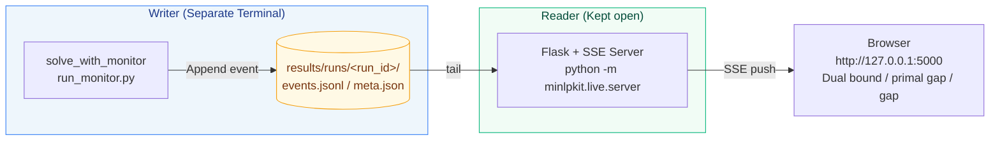

# How to Use the Live Monitor

[← User Manual Index](index.en.md)

!!! info "Scope of this page"
    Covers the specific operation procedures and API for live monitoring and run recording. For the intent of separating the writer/reader and when it's useful, refer to [Method Guide 9. Live Monitoring, Run Recording, and Reproduction](../playbook/09-live-monitor.en.md).

TensorBoard style (**Writer/Reader Separation**). Used with 2 terminals. The writer (solver) simply appends logs to a file, and the reader (Flask + SSE server) tails it and live streams it to the browser — an identical configuration to `train.py` writing logs and `tensorboard` visualizing them in a separate process.



```powershell
# Reader (Kept open): Live UI + Results Gallery Delivery
uv run python -m minlpkit.live.server  # http://127.0.0.1:5000 (Backward compatibility: python -m viz.server is also possible)

# Writer (Separate Terminal): Appends logs to results/runs/<run_id>/ while solving
uv run python experiments/run_monitor.py --model plant --time 120 --gap 0.01
```

- The browser automatically selects the latest run and live updates the dual bound, primal gap, and gap via SSE.
- **Run Comparison Mode**: When you select 2 runs in the run selector, it overlays the dual, primal, and gap for run A (blue) / run B (orange). The legend will show the run name (model name + start time + status + final gap).
- **Results Gallery**: `http://127.0.0.1:5000/results/index.html` is a collection of links to all HTML artifacts (tree / attribution / violation / condition / benders / colgen / sos …) in `results/`.

## Run Recording and Reproducibility

`solve_with_monitor(..., logger=...)` automatically captures the run conditions just before solving and saves them in the `capture` key of `results/runs/<run_id>/meta.json` (opt-out with `capture=False`).
This allows you to trace back "under what conditions this run was solved" (the foundation of Optimization MLOps):

- **`scip_params_diff`**: A `{name: value}` dictionary of SCIP parameters that differ from the raw `Model()` defaults. Only settings specific to that run, like time limits and heuristics settings, are kept (since the default clocktype=2, usually just `limits/*`, or a few dozen with things like `setHeuristics(OFF)`).
- **`fingerprint`**: Pre-presolve variable breakdown (`n_bin`/`n_int`/`n_cont`), constraint breakdown (`n_linear`/`n_nonlinear`/`conss_by_handler`), objective direction, and model name.
- **`env`**: OS and versions of minlpkit / Python / PySCIPOpt / SCIP.
- **`git_sha`**: The git HEAD of the working directory (only if git is available in the repository).

Each item is independently exception-handled; even if acquisition fails, the solving does not stop (missing items are simply omitted by key).
It can also be called individually as `minlpkit.live.capture_run_conditions(model)`. Existing runs (without the capture key) can still be read by the server (backward compatibility).

## Sweep Execution + Rerun

`minlpkit.live.sweep` (also available via lazy import as `mk.sweep`) performs a grid search over candidate sets of SCIP parameters.
**Since each set is recorded in `results/runs/` as a normal run**, the Live UI described above (run list / checkbox comparison) directly becomes the sweep results comparison UI (there is no dedicated UI).

```python
import minlpkit as mk
import scheduling  # samples/

param_sets = [{}, {"separating/maxroundsroot": 0}]
df = mk.sweep(scheduling.build_model, param_sets, name="sched", time_limit=10)
# df: index / param_set / run_id / final_dual / final_gap / nodes / time / status
```

`mk.rerun(build_fn, run_id, time_limit=None)` reads the `meta.capture.scip_params_diff` of a recorded run, applies it to a new model from the same `build_fn`, and re-solves it (reproduction execution from recorded conditions).
It is recorded as a new run, leaving the original run_id in `meta.rerun_of`. Attempting this on a run without a capture (an old run solved with `capture=False`) will explicitly fail with a `ValueError`.

```python
new_run_id = mk.rerun(scheduling.build_model, df["run_id"][0], time_limit=20)
```

CLI: `uv run python experiments/run_sweep.py --model sched --time 6` runs a built-in demo (4 sets varying separating/heuristics intensity), and outputs a parallel coordinates plot (parameter axis + final_dual/final_gap axes) to `results/sweep.html`.
You can specify an arbitrary yaml file containing `param_sets:` using `--config sweep.yaml` (PyYAML is used only within the CLI, and is not added to the core dependencies of minlpkit).

API: [`mk.sweep`/`mk.rerun`/`solve_with_monitor`/`RunLogger`](../api/live.en.md).