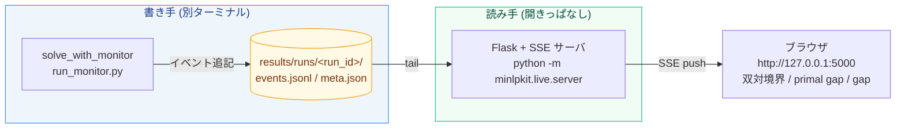

# ライブモニタの使い方

[← 利用マニュアル目次](index.md)

!!! info "このページの範囲"
    ライブ監視・run記録の具体的な操作手順とAPIを扱う。書き手/読み手分離の狙いや
    いつ使うと役立つかは[手法ガイド 9. ライブ監視・run記録・再現](../playbook/09-live-monitor.md)
    を参照。

TensorBoard 型(**書き手/読み手分離**)。2ターミナルで使う。書き手(ソルバー)はログを
ファイルへ追記するだけ、読み手(Flask+SSEサーバ)がそれを tail してブラウザへライブ配信する
――`train.py` がログを書き、`tensorboard` が別プロセスで可視化するのと同型の構成。



```powershell
# 読み手(開きっぱなし): ライブUI + 成果ギャラリー配信
uv run python -m minlpkit.live.server  # http://127.0.0.1:5000(後方互換: python -m viz.server も可)

# 書き手(別ターミナル): 求解しながら results/runs/<run_id>/ にログを追記
uv run python experiments/run_monitor.py --model plant --time 120 --gap 0.01
```

- ブラウザは最新 run を自動選択し、SSE で双対境界・primal gap・gap をライブ更新する。
- **run 比較モード**: run セレクタで2つの run を選ぶと、run A(青)/ run B(オレンジ)で双対・primal・gap
  を重ね描画する。凡例に run 名(モデル名 + 開始時刻 + status + 最終gap)が出る。
- **成果ギャラリー**: `http://127.0.0.1:5000/results/index.html` が `results/` の全成果物HTML
  (tree / attribution / violation / condition / benders / colgen / sos …)へのリンク集。

## run の記録と再現性

`solve_with_monitor(..., logger=...)` は求解直前に run 条件を自動キャプチャし、
`results/runs/<run_id>/meta.json` の `capture` キーへ残す(`capture=False` でオプトアウト)。
これにより「どの条件で解いた run か」が後から辿れる(最適化 MLOps の土台):

- **`scip_params_diff`**: 素の `Model()` のデフォルトと異なる SCIP パラメータの `{name: value}`。
  時間制限やヒューリスティクス設定など、その run 固有の設定だけが残る(既定 clocktype=2 のため
  通常は `limits/*` のみ、`setHeuristics(OFF)` 等で数十個)。
- **`fingerprint`**: presolve 前の変数内訳(`n_bin`/`n_int`/`n_cont`)・制約内訳(`n_linear`/
  `n_nonlinear`/`conss_by_handler`)・目的の向き・モデル名。
- **`env`**: minlpkit / Python / PySCIPOpt / SCIP のバージョンと OS。
- **`git_sha`**: 作業ディレクトリの git HEAD(リポジトリ内で git があるときのみ)。

各項目は独立に例外処理され、取得に失敗しても求解は止まらない(欠けた項目はキーごと省略)。
単体でも `minlpkit.live.capture_run_conditions(model)` として呼べる。既存 run(capture キーなし)は
そのまま server が読める(後方互換)。

## スイープ実行 + rerun

`minlpkit.live.sweep`(`mk.sweep` でも遅延importで利用可)は SCIP パラメータの候補群を総当たりする。
**各セットは通常の run として `results/runs/` に記録される**ため、上記のライブUI(runs一覧・
チェックボックス比較)がそのままスイープ結果比較UIになる(専用UIは無い)。

```python
import minlpkit as mk
import scheduling  # samples/

param_sets = [{}, {"separating/maxroundsroot": 0}]
df = mk.sweep(scheduling.build_model, param_sets, name="sched", time_limit=10)
# df: index / param_set / run_id / final_dual / final_gap / nodes / time / status
```

`mk.rerun(build_fn, run_id, time_limit=None)` は記録済み run の `meta.capture.scip_params_diff`
を読み出し、同じ `build_fn` の新モデルへ適用して再求解する(記録条件からの再現実行)。
新 run として記録され、`meta.rerun_of` に元の run_id が残る。capture の無い run(`capture=False`
で求解した旧run)には `ValueError` で明確に失敗する。

```python
new_run_id = mk.rerun(scheduling.build_model, df["run_id"][0], time_limit=20)
```

CLI: `uv run python experiments/run_sweep.py --model sched --time 6` で組み込みデモ
(separating/heuristics 強度を変える4セット)を実行し、`results/sweep.html` に
parallel coordinates 図(パラメータ軸 + final_dual/final_gap 軸)を出力する。
`--config sweep.yaml` で `param_sets:` を書いた任意の yaml を指定できる
(PyYAML は CLI 内でのみ使用、minlpkit のコア依存には追加していない)。

API: [`mk.sweep`/`mk.rerun`/`solve_with_monitor`/`RunLogger`](../api/live.md)。
