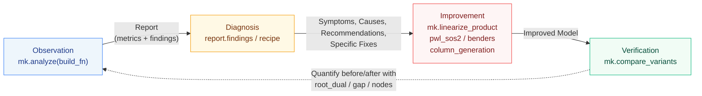

# Overall Workflow

[← User Manual Index](index.en.md)

The key point of minlpkit is to **keep observation and improvement within the same library**. Since each finding in the diagnosis has a `recipe` (the mk function to use and a worked example), "symptom → which function to fix it with" is directly connected.



Improvement is inherently dependent on model structure, so it is not fully automated (even SCIP does not automate reformulation).
What the library provides are **reusable components + verification procedures**.

## Minimal End-to-End Example (Copy-pasteable)

```python
import minlpkit as mk
from pyscipopt import Model

# Compare solving n·s >= 12 as bilinear vs strictly linearized
def baseline():
    m = Model(); m.hideOutput()
    n = m.addVar(vtype="I", lb=1, ub=3, name="n")
    s = m.addVar(lb=0.0, ub=10.0, name="s")
    m.addCons(n * s >= 12)                       # Bilinear (McCormick relaxation)
    m.setObjective(n + s, "minimize")
    return m

def improved():
    m = Model(); m.hideOutput()
    n = m.addVar(vtype="I", lb=1, ub=3, name="n")
    s = m.addVar(lb=0.0, ub=10.0, name="s")
    ns = mk.linearize_product(m, n, s, 1, 3, 0.0, 10.0, "ns")  # Strict linearization
    m.addCons(ns >= 12)
    m.setObjective(n + s, "minimize")
    return m

df = mk.compare_variants({"baseline": baseline, "improved": improved}, time_limit=5)
print(df[["variant", "root_dual", "final_dual", "final_gap", "nodes"]].to_string(index=False))
```

`demo.py` performs the same flow on a real model (scheduling_plant) and is a full version that even includes the diagnostic display of `analyze`.

## API Reference (Roles and worked examples)

For arguments, return values, and precautions for each API, refer to the **[API Reference](../api/pipeline.en.md)**.
Here we map the role of each API to its corresponding worked example.

| API | Role | worked example |
| --- | --- | --- |
| `mk.analyze(build_fn, name, time_limit, interval_terms_fn)` | Collect metrics + diagnose → `Report` | `demo.py`, `experiments/run_diagnose.py` → `results/diagnose_*.html` |
| `mk.collect_metrics(build_fn, ...)` | Collect only the metrics dict (input for diagnosis) | `experiments/run_diagnose.py` |
| `mk.Report` | Holds `metrics` / `findings`. `.summary()` / `.dashboard(path)` | `results/report_plant.html` |
| `mk.compare_variants({name: build_fn}, time_limit)` | Compare before/after with root dual bound, gap, and nodes | `experiments/run_improve_linearize.py` → `results/improve_linearize.html` |
| `mk.linearize_product(m, y, x, y_lb, y_ub, x_lb, x_ub, name)` | Strictly linearize the product of integer × continuous | `samples/others/scheduling_plant.py`, `results/improve_linearize.html` |
| `mk.pwl_sos2(m, x, breakpoints, values, name)` | Piecewise linear approximation of a 1-variable function using SOS2 (no Big-M required) | `samples/physics_and_control_minlp/pwl_sos.py`, `experiments/run_sos.py` → `results/sos.html` |
| `mk.perspective_quadratic(m, u, p, fc, a, b, c, name)` | Perspective reformulation of semi-continuous quadratic costs (**Not recommended for regular use**, see [Pitfalls](pitfalls.en.md)) | `experiments/run_perspective.py` → `results/perspective.html` |
| `mk.column_generation(rhs, init_columns, pricing_fn, alpha)` | Column Generation (Gilmore-Gomory / Wentges stabilization) | `experiments/run_colgen.py` / `run_stabilize.py` → `results/colgen.html` / `stabilize.html` |
| `mk.price_and_branch(rhs, init_columns, pricing_fn)` | Column generation + integer master problem (integer solution is an **upper bound**) | `experiments/run_bnp.py` → `results/bnp.html` |
| `mk.benders(master_build, subproblem_solve)` | Benders Decomposition (Callback method) | `experiments/run_benders.py` → `results/benders.html` |
| `mk.cuopt_warmstart(model, time_limit, cuopt_cmd, server_url, mps_dir, heuristics_only)` | Warm start injection of cuOpt (GPU) solution into SCIP (WSL2 CLI or remote HTTP server) | `experiments/run_gpu_heuristic.py` → [GPU Setup](gpu-setup.en.md) |
| `mk.cuopt_concurrent(model, time_limit, server_url, num_cpu_threads, ...)` | Resident type: run cuOpt concurrently with SCIP and inject mid-solve when finished (zero GPU wait) | [GPU Setup: Resident Type](gpu-setup.en.md) |
| `mk.RULES` / `mk.Rule` / `mk.evaluate(metrics)` | Diagnostic rules (pluggable) | "Diagnostic rules list" below |

As helper functions for static diagnosis like condition numbers, there are `matrix_condition(model)` ($\kappa(A)$ by SVD, before solve) and `scip_basis_condition(model)` (SCIP LP basis $\kappa$, after solve). Worked examples are `experiments/run_condition.py` → `results/condition.html`.

## Diagnostic rules list (7 rules) {: #rules}

Transcription of `RULES` from `minlpkit/collectors/diagnose.py`. `mk.evaluate(metrics)` returns triggered rules in order of importance (critical → serious → warning → good).

| id | Symptom | Trigger condition (threshold) | Recommendation / recipe |
| --- | --- | --- | --- |
| `weak_relaxation` (serious) | Relaxation violations are concentrated in specific nonlinear constraints (and many spatial branches) | `bottleneck_rel_viol ≥ 0.5` and `spatial_share ≥ 0.3` | Piecewise linear approximation, convex hull reformulation, variable bound tightening. **recipe**: for integer × continuous use `mk.linearize_product`, for nonlinear 1-variable use `mk.pwl_sos2` (e.g., improve_linearize.html, sos.html) |
| `wide_term_range` (warning) | Wide range of values for nonlinear terms (interval arithmetic) | `widest_term_rel ≥ 1.5` | Variable bound tightening, piecewise linearization. **recipe**: `mk.linearize_product` or bound tightening (e.g., interval.html, improve_linearize.html) |
| `dual_stall` (warning) | Dual bound improvement stalls (gap remains) | `n_stalls ≥ 1` and `gap ≥ 0.05` | Strengthen relaxation by adding valid inequalities, tightening bounds, eliminating Big-M. **recipe**: Verify effectiveness with `mk.compare_variants` (e.g., attribution.html) |
| `numerical_scale` (warning) | Coefficient ranges differ by orders of magnitude / Big-M candidates (remaining after presolve) | `residual_coef_ratio ≥ 1e6` or `residual_bigm_count ≥ 1` | Scaling, changing Big-M to Indicator/SOS. **recipe**: Replace Big-M with actual bounds/Indicator/SOS, `mk.pwl_sos2`. Check condition numbers with `matrix_condition`/`scip_basis_condition` (e.g., sos.html, condition.html) |
| `gpu_primal` (warning) | Finding feasible solutions is slow/scarce in large-scale linear binary problems (gap remains) | `has_nonlinear=False` and `n_bin_vars ≥ 10000` and `eq_overlap ≤ 1.5` and (`nsols ≤ 3` or TTFF exceeds 30% of solve time) and `gap ≥ 0.05` | Warm start injection using GPU primal heuristics. **recipe**: `mk.cuopt_warmstart(m, time_limit=15)` (requires WSL2+cuOpt). Set partitioning models where equality constraints share variables (`eq_overlap≫1`) may cause FJ-like heuristics to fail → consider column generation (e.g., gap_large_compare.html) |
| `symmetry_info` (**good**) | Detects swappable groups of variables (symmetry) | `sym_sound` and `largest_sym_group ≥ 3` | **Normally requires no action (SCIP handles it automatically)**. Lexicographic elimination is effective only in operations where usesymmetry is disabled (e.g., symmetry.html) |
| `decomposable` (good) | Constraint-variable block structure + small number of linking constraints | `max_linking_groups ≥ 4` and `n_heavy_linking ≤ 3` | Benders / Dantzig-Wolfe decomposition. **recipe**: `mk.benders` or `mk.column_generation`/`mk.price_and_branch` (e.g., benders.html, bnp.html) |

It is intentional that `symmetry_info` is **good** (information rather than a recommendation). This is because SCIP's built-in symmetry handling corresponds by default, and manual lexicographic elimination ranges from ineffective to worsening (actual measurements are in [Pitfalls](pitfalls.en.md) and `FINDINGS.md`).

Diagnostic rules are pluggable. You can add custom rules with `mk.RULES.append(mk.Rule(...))`.