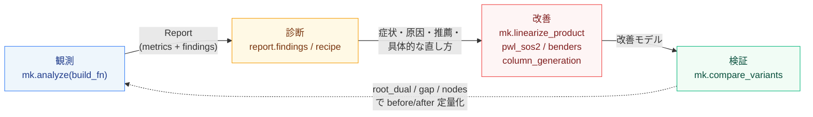

# ワークフロー全体像

[← 利用マニュアル目次](index.md)

観測と改善を**同じライブラリで閉じる**のが minlpkit の要点。診断の各 finding は `recipe`
(使う mk 関数と worked example)を持つので、「症状 → どの関数で直すか」が直結する。



改善は本質的にモデル構造依存なので全自動化はしない(SCIP ですら再定式化は自動化しない)。
ライブラリが与えるのは**再利用可能な部品 + 検証手順**である。

## 最小の一気通貫例(コピペ可)

```python
import minlpkit as mk
from pyscipopt import Model

# n·s >= 12 を、双線形のまま解く版と厳密線形化する版で比較
def baseline():
    m = Model(); m.hideOutput()
    n = m.addVar(vtype="I", lb=1, ub=3, name="n")
    s = m.addVar(lb=0.0, ub=10.0, name="s")
    m.addCons(n * s >= 12)                       # 双線形(McCormick緩和)
    m.setObjective(n + s, "minimize")
    return m

def improved():
    m = Model(); m.hideOutput()
    n = m.addVar(vtype="I", lb=1, ub=3, name="n")
    s = m.addVar(lb=0.0, ub=10.0, name="s")
    ns = mk.linearize_product(m, n, s, 1, 3, 0.0, 10.0, "ns")  # 厳密線形化
    m.addCons(ns >= 12)
    m.setObjective(n + s, "minimize")
    return m

df = mk.compare_variants({"baseline": baseline, "improved": improved}, time_limit=5)
print(df[["variant", "root_dual", "final_dual", "final_gap", "nodes"]].to_string(index=False))
```

`demo.py` は同じ流れを実モデル(scheduling_plant)でやり、`analyze` の診断表示まで含む
フル版である。

## API リファレンス(役割と worked example)

各 API の引数・返り値・注意点は **[API リファレンス](../api/pipeline.md)** を参照。
ここでは各APIの役割と対応する worked example(実装例)を対応づける。

| API | 役割 | worked example |
| --- | --- | --- |
| `mk.analyze(build_fn, name, time_limit, interval_terms_fn)` | 観測量収集 + 診断 → `Report` | `demo.py`, `experiments/run_diagnose.py` → `results/diagnose_*.html` |
| `mk.collect_metrics(build_fn, ...)` | 観測量 dict だけを集める(診断の入力) | `experiments/run_diagnose.py` |
| `mk.Report` | `metrics` / `findings` を保持。`.summary()` / `.dashboard(path)` | `results/report_plant.html` |
| `mk.compare_variants({名前: build_fn}, time_limit)` | before/after をルート双対境界・gap・ノードで比較 | `experiments/run_improve_linearize.py` → `results/improve_linearize.html` |
| `mk.linearize_product(m, y, x, y_lb, y_ub, x_lb, x_ub, name)` | 整数×連続の積を厳密線形化 | `samples/others/scheduling_plant.py`, `results/improve_linearize.html` |
| `mk.pwl_sos2(m, x, breakpoints, values, name)` | 1変数関数を SOS2 で区分線形近似(Big-M不要) | `samples/physics_and_control_minlp/pwl_sos.py`, `experiments/run_sos.py` → `results/sos.html` |
| `mk.perspective_quadratic(m, u, p, fc, a, b, c, name)` | 半連続二次費用の遠近化(**常用非推奨**、[落とし穴](pitfalls.md)参照) | `experiments/run_perspective.py` → `results/perspective.html` |
| `mk.column_generation(rhs, init_columns, pricing_fn, alpha)` | 列生成(Gilmore-Gomory / Wentges安定化) | `experiments/run_colgen.py` / `run_stabilize.py` → `results/colgen.html` / `stabilize.html` |
| `mk.price_and_branch(rhs, init_columns, pricing_fn)` | 列生成 + 整数主問題(整数解は**上界**) | `experiments/run_bnp.py` → `results/bnp.html` |
| `mk.benders(master_build, subproblem_solve)` | ベンダーズ分解(コールバック方式) | `experiments/run_benders.py` → `results/benders.html` |
| `mk.cuopt_warmstart(model, time_limit, cuopt_cmd, server_url, mps_dir, heuristics_only)` | cuOpt(GPU)の解をSCIPへwarm start注入(WSL2 CLI or リモートHTTPサーバ) | `experiments/run_gpu_heuristic.py` → [GPU設定](gpu-setup.md) |
| `mk.cuopt_concurrent(model, time_limit, server_url, num_cpu_threads, ...)` | 常駐型: cuOptをSCIPと並走させ終了次第mid-solve注入(GPU待ちゼロ) | [GPU設定: 常駐型](gpu-setup.md) |
| `mk.RULES` / `mk.Rule` / `mk.evaluate(metrics)` | 診断ルール(プラガブル) | 下記「診断ルール一覧」 |

条件数など静的診断の補助関数として、`matrix_condition(model)`(SVD による κ(A)、solve前)と
`scip_basis_condition(model)`(SCIP LP基底 κ、solve後)がある。worked example は
`experiments/run_condition.py` → `results/condition.html`。

## 診断ルール一覧(7ルール) {: #rules}

`minlpkit/collectors/diagnose.py` の `RULES` を転記。`mk.evaluate(metrics)` は発火したルールを
重要度順(critical→serious→warning→good)で返す。

| id | 症状 | 発火条件(閾値) | 推薦 / recipe |
| --- | --- | --- | --- |
| `weak_relaxation` (serious) | 特定の非線形制約に緩和違反が集中(かつ空間分枝が多い) | `bottleneck_rel_viol ≥ 0.5` かつ `spatial_share ≥ 0.3` | 区分線形近似・凸包再定式化・変数境界タイト化。**recipe**: 整数×連続は `mk.linearize_product`、非線形1変数は `mk.pwl_sos2`(例: improve_linearize.html, sos.html) |
| `wide_term_range` (warning) | 非線形項の値域(区間演算)が広い | `widest_term_rel ≥ 1.5` | 変数境界タイト化・区分線形化。**recipe**: `mk.linearize_product` か境界タイト化(例: interval.html, improve_linearize.html) |
| `dual_stall` (warning) | 双対境界の改善が停滞(gapが残る) | `n_stalls ≥ 1` かつ `gap ≥ 0.05` | 有効不等式追加・境界タイト化・Big-M排除で緩和強化。**recipe**: 効果は `mk.compare_variants` で検証(例: attribution.html) |
| `numerical_scale` (warning) | 係数レンジが桁違い / Big-M候補(presolve後も残存) | `residual_coef_ratio ≥ 1e6` または `residual_bigm_count ≥ 1` | スケーリング・Big-MのIndicator/SOS化。**recipe**: Big-Mを実bound/Indicator/SOSに置換、`mk.pwl_sos2`。条件数は `matrix_condition`/`scip_basis_condition` で確認(例: sos.html, condition.html) |
| `gpu_primal` (warning) | 大規模な線形バイナリ問題で可行解の発見が遅い/少ない(gapが残る) | `has_nonlinear=False` かつ `n_bin_vars ≥ 10000` かつ `eq_overlap ≤ 1.5` かつ(`nsols ≤ 3` または TTFFが求解時間の3割超)かつ `gap ≥ 0.05` | GPU primal heuristics のwarm start注入。**recipe**: `mk.cuopt_warmstart(m, time_limit=15)`(要 WSL2+cuOpt)。等式が変数を共有する集合分割型(`eq_overlap≫1`)はFJ系不発→列生成を検討(例: gap_large_compare.html) |
| `symmetry_info` (**good**) | 入替可能な変数群(対称性)を検出 | `sym_sound` かつ `largest_sym_group ≥ 3` | **通常は対応不要(SCIPが自動処理)**。usesymmetry を無効化した運用でのみ辞書式除去が有効(例: symmetry.html) |
| `decomposable` (good) | 制約-変数がブロック構造 + 少数の結合制約 | `max_linking_groups ≥ 4` かつ `n_heavy_linking ≤ 3` | ベンダーズ / Dantzig-Wolfe 分解。**recipe**: `mk.benders` か `mk.column_generation`/`mk.price_and_branch`(例: benders.html, bnp.html) |

`symmetry_info` が **good**(推薦でなく情報)なのは意図的。SCIP 内蔵の対称性処理が既定で対応し、
手動の辞書式除去は無効〜悪化するため(実測は [落とし穴](pitfalls.md) と `FINDINGS.md`)。

診断ルールはプラガブル。`mk.RULES.append(mk.Rule(...))` で独自ルールを足せる。
