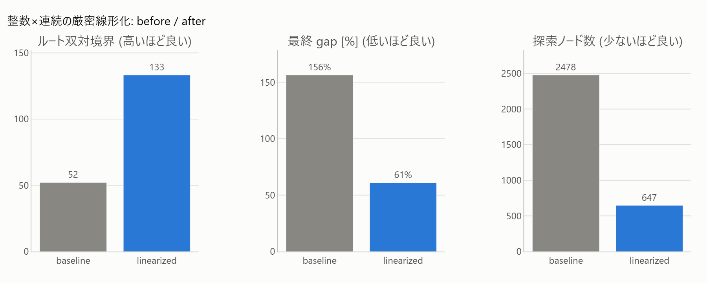

# 1. Strict Linearization of Integer × Continuous

[← Method Guide Index](index.en.md)

### Do you have these challenges?

- The product of "integer quantity × continuous quantity" (number of batches × size, number of machines × operation time, etc.) appears in the constraints.
- SCIP is supposed to solve it using McCormick relaxation, but the gap doesn't close at all.
- The diagnosis outputs `weak_relaxation` (serious), and the bilinear term you wrote is listed in the evidence.

### What you can learn from the diagnostics

`weak_relaxation` triggers when "relaxation violations are concentrated in specific nonlinear constraints (`bottleneck_rel_viol ≥ 0.5`), and the contribution of spatial branching is large (`spatial_share ≥ 0.3`)". The evidence will show the bottleneck constraint name, its relative violation, and the contribution rate of spatial branching. `wide_term_range` may also appear earlier as a precursor to the same symptom (the value range seen by interval arithmetic is wide).

### How the actions work

SCIP handles the product $w = yx$ of "integer $y$ × continuous $x$" just like a general bilinear term, using **McCormick relaxation** (a convex hull approximation bounded by 4 linear inequalities).

$$
\begin{aligned}
w &\ge \underline{y}x + y\underline{x} - \underline{y}\,\underline{x}, &
w &\ge \overline{y}x + y\overline{x} - \overline{y}\,\overline{x},\\
w &\le \overline{y}x + y\underline{x} - \overline{y}\,\underline{x}, &
w &\le \underline{y}x + y\overline{x} - \underline{y}\,\overline{x}.
\end{aligned}
$$

However, if $y$ is an integer, by placing an indicator variable $\delta_v$ (1 when $y=v$) for each possible value $v \in \{\underline{y},\dots,\overline{y}\}$ and decomposing $x$, you can express it exactly linearly with a **relaxation gap of 0**.

$$
\sum_v \delta_v = 1,\quad
y = \sum_v v\,\delta_v,\quad
x = \sum_v x_v,\quad
w = \sum_v v\,x_v,\quad
0 \le x_v \le \overline{x}\,\delta_v .
$$

The smaller the range of $y$, the fewer auxiliary variables are needed, making it more efficient. The intuition is that McCormick throws away the information that "$y$ is an integer," while this decomposition uses it fully.

### Effect (Actual measurements in this repository)

Applied to `scheduling_plant` (triple product of batch count n × batch size s: n·s·(T-T0)):
**Root dual bound 52→125 (+140%), gap at 25 seconds solve 127%→49%, node count 7578→3840**, while the optimal value remains unchanged ([`improve_linearize.html`](../gallery/improve_linearize.html), FINDINGS §3).
In horizontal deployment verification after making it a general-purpose helper, `plant` got +156% (52→133), and the easier `scheduling` got +1% (132→133, the room for improvement is small since it was originally easy).



To follow along with diagrams from the principle (gap in the McCormick envelope) to the effect measurement, see [Strict Linearization of Integer × Continuous](../notebooks/improve/01_linearize_product.en.ipynb).

### When it doesn't work / Notes

- **If the range of y (the integer side) is wide, the auxiliary variables and constraints will increase linearly**. It is suitable for products where the range on the integer side is small, like batch count × batch size.
- Just blindly adding valid inequalities "because the product is bilinear" is counterproductive. Naively adding `n·s ≥ demand` adds a **new non-convex constraint** since n·s itself is bilinear, causing the root dual bound to **worsen from 52.13 to 50.48** (FINDINGS §2). The effect is reversed between adding constraints "after linearizing" and adding them "while still bilinear."
- It is only effective in cases where "the weakness of the non-convex relaxation is the bottleneck." In the [Diagnostic Benchmark](../census.en.md), `weak_relaxation` triggered in only 1 out of 11 nonlinear models, so it doesn't come into play for many models (the effect is problem-dependent).

### How to use

```python
import minlpkit as mk

ns = mk.linearize_product(m, n, s, y_lb=1, y_ub=3, x_lb=0.0, x_ub=10.0, name="ns")
m.addCons(ns >= 12)   # n*s >= 12 becomes a strict linear constraint
```

API: [`mk.linearize_product`](../api/transforms.en.md).
Worked example: `samples/others/scheduling_plant.py` (`linearize_ns=True`),
`experiments/run_improve_linearize.py` → [`improve_linearize.html`](../gallery/improve_linearize.html).