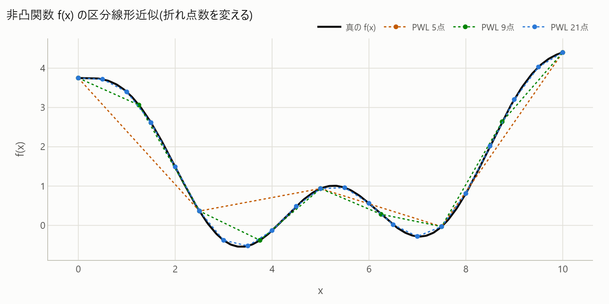

# 2. PWL近似(SOS2)

[← プレイブック目次](index.md)

### こんな課題ありませんか

- 1変数の非凸関数(効率曲線・べき乗コストなど)を区分線形近似したいが、Big-M で表すと
  バイナリ変数が増えて重くなる。

### 診断で何がわかるか

`numerical_scale`(Big-M候補が presolve 後も残存)や `weak_relaxation`(非線形1変数項が
ボトルネック)の recipe に、区分線形近似の選択肢として案内される。

### 打ち手の仕組み

区分線形関数 y=f(x) は、隣接する折れ点 (bp_k, v_k) の凸結合で表せる。通常この「隣接性」
(non-zero な重みλが連続する2点に限られる)を保証するのに Big-M + バイナリを使うが、
**SOS2制約**(Special Ordered Set type 2: 非ゼロが高々2つ、かつ隣接)を SCIP に直接渡せば、
バイナリ変数もBig-Mも一切使わずに同じ性質を表現できる。SCIP が SOS2 制約専用の分枝規則を
持っているため、余計な補助変数を経由しない分だけ探索が軽い。

### 効果(このリポジトリでの実測)

非凸1変数関数の PWL 近似で、Big-M版は**バイナリ変数20個**を要したのに対し、
SOS2版は**バイナリ0個**で同じ最適値に到達する(FINDINGS §3、
[`sos.html`](../gallery/sos.html))。折れ点を増やすほど近似は真の曲線に近づくが、
Big-M のバイナリは折れ点数に比例して増える一方、SOS2 は 0 のまま。



折れ点・近似誤差・モデル規模のトレードオフを図付きで追うには
[PWL近似(SOS2)](../notebooks/improve/02_pwl_sos2.ipynb) を参照。

### 効かないとき・注意

- 1変数関数専用。多変数の非凸項(積など)には使えない → その場合は
  [1. 整数×連続の厳密線形化](01-linearize.md) や凸包再定式化を検討する。
- 区分数を増やすほど近似精度は上がるが λ 変数も増える(トレードオフ)。

### 使い方

```python
import minlpkit as mk

# f(x)=x^2 を3点で区分線形近似
y = mk.pwl_sos2(m, x, breakpoints=[0.0, 1.0, 2.0], values=[0.0, 1.0, 4.0], name="sq")
```

API: [`mk.pwl_sos2`](../api/transforms.md)。
Worked example: `samples/physics_and_control_minlp/pwl_sos.py`、
`experiments/run_sos.py` → [`sos.html`](../gallery/sos.html)。
