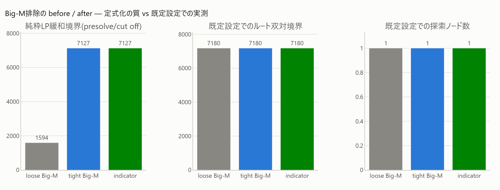

# 3. Big-M排除(tight M・Indicator)

[← プレイブック目次](index.md)

### こんな課題ありませんか

- 固定費(施設開設・段取り替えなど)を Big-M でモデル化していて、「M をいくつにすべきか」
  自信がない。
- 診断が `numerical_scale` を出し、`residual_bigm_count` に残存 Big-M があると言っている。

### 診断で何がわかるか

`numerical_scale`(warning)は presolve **後**の残存係数比(`residual_coef_ratio ≥ 1e6`)
または残存 Big-M 件数(`residual_bigm_count ≥ 1`)で発火する。presolve前の生の係数比では
判断しない設計になっている点に注意(次の「効かないとき」参照)。

### 打ち手の仕組み

Big-M 制約 `x ≤ M·u`(u はバイナリ)は M が緩い(実際に必要な値より大きい)ほど LP 緩和が
緩む。打ち手は2つ:

1. **tight M**: 変数境界などから導出できる最小の M に絞る。
2. **Indicator制約**: `u=1 → x ≤ c` のような論理制約を SCIP の Indicator 機能に直接渡す。
   Big-M の値そのものを選ぶ必要がなくなる。

### 効果(このリポジトリでの実測)

緩い Big-M を持つ固定費モデル(8施設)で、純粋LP緩和境界が **1594→7127(+347%)**、
最適値7180にほぼ到達する(FINDINGS §3、[`improve_bigm.html`](../gallery/improve_bigm.html))。
条件数も緩いBig-Mで κ(A)=3.5e4 → tight化で κ=32 と**100倍以上改善**する(FINDINGS §3b)。



原理(Mの大小がLP緩和領域をどう広げるか)から効果測定までを図付きで追うには
[手法notebook: Big-M排除(tight M・Indicator)](../notebooks/improve/03_bigm_indicator.ipynb) を参照。

### 効かないとき・注意

- **正直な注意点**: 上記の LP 緩和境界の改善とは裏腹に、**既定 SCIP は presolve が緩い
  Big-M を自動でタイト化する**ため、小規模なモデルでは最終的な求解時間は変わらないことが
  多い(素B&Bのノード数 11→9→8 と小さな改善に留まる)。効果が緩和境界の数字ほど
  実感できるのは presolve が効きにくい大規模/複雑な構造のとき。
- `numerical_scale` の閾値は presolve **後**の残存値(真の悪条件 1e6)で判断している。
  presolve前の係数比(例: 1e5)だけを見て「悪い」と判断しないこと — 実測では presolve前
  1e5・presolve後 1.0(Big-M候補 8→0)というケースが典型で、これは発火させない設計
  (FINDINGS §1)。

### 使い方

```python
# Indicator制約(u=1 のとき x <= c)
m.addConsIndicator(x <= c, binvar=u)
```

`mk.linearize_product`/`mk.pwl_sos2` のように専用ヘルパーは無く、PySCIPOpt の
`addConsIndicator` を直接使う。条件数の確認は `matrix_condition(model)`(SVD、solve前)
と `scip_basis_condition(model)`(SCIP LP基底、solve後)。詳細は
[8. 条件数・数値健全性](08-condition.md)。
Worked example: `samples/others/fixed_charge.py`、
`experiments/run_improve_bigm.py` → [`improve_bigm.html`](../gallery/improve_bigm.html)、
`experiments/run_condition.py` → [`condition.html`](../gallery/condition.html)。
