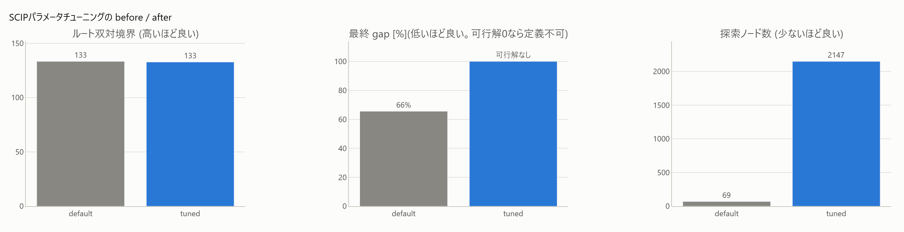

# 4. SCIPパラメータチューニング(Optuna)とスイープ

[← プレイブック目次](index.md)

### こんな課題ありませんか

- SCIPのパラメータ(分離/ヒューリスティクス/presolve/分枝規則)が多すぎて、どのパラメータを
  調整すべきか判断できない。
- 「このモデル群(同じ問題クラスの複数インスタンス)に効く設定」を体系的に探したい。

### 診断で何がわかるか

診断は無関係(パラメータチューニングは症状ベースの推薦対象ではなく、モデル構造に依存しない
メタ最適化)。ただし `dual_stall` の recipe は「効果は `mk.compare_variants` で検証」と
案内しており、チューニング後の設定もこの検証ループに乗せる。

### 打ち手の仕組み

SCIP の挙動(分離の強さ・ヒューリスティクスの頻度・presolveの積極性・分枝規則)は
`SCIP_PARAMSETTING`(default/aggressive/fast/off)などで一括制御できる。どの組み合わせが
「固定時間での双対境界」を最大化するかは問題クラス依存で理論的に決め打てないため、
Optuna(TPEサンプラー)でベイズ最適化的に探索する。`mk.sweep` はその一段シンプルな版で、
候補パラメータセットを総当たりして比較する。

### 効果(このリポジトリでの実測)

線形化版plant で固定7秒の双対境界を最大化する設定を探索した結果、
デフォルト **134.8 → 最良 143.7(+6.6%)**。最良設定は
`separating=fast, heuristics=fast, branching=mostinf`(カット/ヒューリスティクスを軽くし
分岐で双対を押す構成)(FINDINGS §3、[`tune.html`](../gallery/tune.html))。



原理(パラメータの違いによる収束曲線の差)から適用・効果測定までを図付きで追うには
[SCIPパラメータチューニング](../notebooks/improve/04_tuning.ipynb) を参照
(Optunaが双対境界だけを目的関数に探索すると可行解を犠牲にしうる、という実例も収録)。

### 効かないとき・注意

- 効果は数%オーダーの上積みであり、[1. 厳密線形化](01-linearize.md)
  のような定式化の作り込み(+140%)と比べると小さい。**まず定式化を直し、パラメータは
  最後の仕上げ**という順序が妥当。
- 探索は特定のインスタンス(または代表インスタンス群)に対する特化なので、別の規模・構造の
  インスタンスに一般化するとは限らない。運用は代表インスタンス群でチューニングし本番設定を
  固定するのが実務的。

### 使い方

```python
from minlpkit.tune import tune   # extras: uv add "minlpkit[tune]"

result = tune(n_trials=18, time_limit=8.0)
print(result["default_dual"], result["best_dual"], result["best_params"])
```

スイープ(総当たり比較、記録は通常runとしてライブUIでそのまま比較できる):

```python
import minlpkit as mk

param_sets = [{}, {"separating/maxroundsroot": 0}]
df = mk.sweep(build_model, param_sets, name="sched", time_limit=10)  # 要 extras viz
```

API: `minlpkit.tune.tune`([APIリファレンス](../api/tune.md))、[`mk.sweep`/`mk.rerun`](../api/live.md)。
Worked example: `experiments/run_tune.py` → [`tune.html`](../gallery/tune.html)、
`experiments/run_sweep.py` → `results/sweep.html`。
