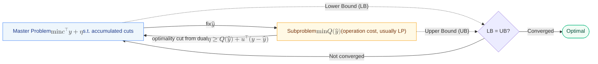
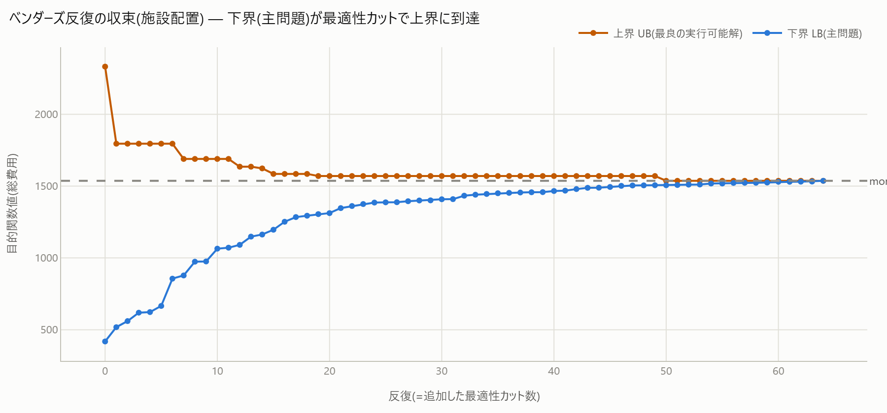

# 5. Benders Decomposition

[← Method Guide Index](index.md)

### Do you have these challenges?

- The model naturally splits into a "design/location decision part" and an "operation/assignment decision part given the former" (e.g., facility opening -> transportation, investment -> operation, etc.).
- The diagnosis outputs `decomposable` (good) = The constraint-variable graph is close to block-diagonal, and there are only a few linking constraints (constraints that span different blocks).

### What the diagnosis reveals

`decomposable` triggers when "the maximum linking constraint spans 4 or more groups of blocks (`max_linking_groups >= 4`), and there are 3 or fewer heavy linking constraints (spanning many blocks) (`n_heavy_linking <= 3`)". The evidence shows "how many groups the maximum linking constraint spans" and "how many heavy linking constraints there are".

### Mechanism of the solution

The problem is divided into a master problem (a small number of decisions like linking variable y = "whether to open") and a subproblem (the remainder when y is fixed, usually LP), and they are solved alternately. From the dual of the subproblem, an **optimality cut** `η >= Q(ŷ) + Σ grad·(y − ŷ)` (a linear lower bound on the subproblem cost Q with respect to y) is created and added to the master problem. This is repeated until the objective of the master problem (lower bound) and the true cost of the subproblem (upper bound) converge. Intuitively, this is an approach of "instead of faithfully embedding the subproblem into the master problem every time, only teach the 'sensitivity' of the subproblem to the master problem".



### Effect (measured in this repository)

The `facility` (facility location) problem is decomposed into a master problem (opening y) and a subproblem (transportation LP). It **perfectly matches** the optimal value 1340 obtained by solving the single problem directly (lower bound = upper bound = 1340), and **converges in 3 iterations with 2 cuts** (lower bound 360 -> 1280 -> 1340, FINDINGS §3, [`benders.html`](../gallery/benders.html)). Even in a scaled-up synthetic instance (14 facilities, 20 customers), the lower and upper bounds converge to exactly match the optimal value of the monolithic problem in the same way (see figure below, 65 iterations, 64 cuts).



To follow the process from the principle (cut back-and-forth loop) to effect measurement with figures, see [Benders Decomposition](../notebooks/improve/05_benders.ipynb).

### When it doesn't work / Cautions

- It assumes the structure (few linking constraints, master and subproblem can be separated). In the [diagnosis benchmark](../census.md), `decomposable` is triggered in 9 instances, so the block structure itself is not rare, but whether decomposition actually reduces computational cost depends on the scale (for small scales, solving the single problem directly might be faster).
- `mk.benders` implemented here **does not handle feasibility cuts** (assuming the model is structured so that the subproblem is always feasible). Extensions are needed for structures where infeasible subproblems can occur.

### How to use

```python
import minlpkit as mk

result = mk.benders(master_build, subproblem_solve, max_iter=50, tol=1e-6)
print(result["lb"], result["ub"], result["n_cuts"])
```

Only two callbacks, `master_build(cuts) -> Model` and `subproblem_solve(y_hat) -> (Q, grad)`, are problem-specific (details in the docstring).
API: [`mk.benders`](../api/frameworks.md).
Worked example: `experiments/run_benders.py` -> [`benders.html`](../gallery/benders.html).
