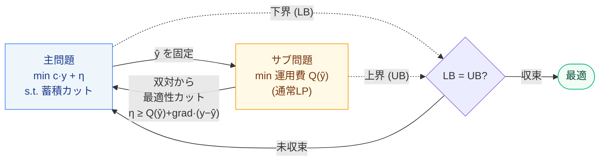

# 5. ベンダーズ分解

[← プレイブック目次](index.md)

### こんな課題ありませんか

- モデルが「設計/配置を決める部分」と「その決定を所与にした運用/割当を決める部分」に
  自然に分かれる(施設開設→輸送、投資→運用、など)。
- 診断が `decomposable`(good)を出している = 制約-変数のグラフがブロック対角に近く、
  結合制約(異なるブロックをまたぐ制約)が少数しかない。

### 診断で何がわかるか

`decomposable` は「最大結合制約が4グループ以上のブロックにまたがり(`max_linking_groups ≥ 4`)、
かつ重い結合制約(多数のブロックにまたがるもの)が3本以下(`n_heavy_linking ≤ 3`)」で発火する。
evidence に「最大結合制約が何グループにまたがるか」「重結合制約は何本か」が出る。

### 打ち手の仕組み

主問題(連結変数 y = 「開設するか」等の少数の意思決定)とサブ問題(y を固定したときの
残り、通常はLP)に分けて交互に解く。サブ問題の双対から**最適性カット**
`η ≥ Q(ŷ) + Σ grad·(y − ŷ)`(サブ費用 Q の y に関する線形下界)を作って主問題に足していく。
主問題の目的(下界)とサブ問題の真の費用(上界)が収束するまで繰り返す。直感的には
「サブ問題を毎回律儀に主問題へ埋め込む代わりに、サブ問題の"感度"だけを主問題に教える」
アプローチ。



### 効果(このリポジトリでの実測)

`facility`(施設配置)を主問題(開設 y)/サブ問題(輸送LP)に分解する。単一問題を直接解いた
最適値 1340 に**完全一致**(下界=上界=1340)、**3反復・2カットで収束**する
(下界 360→1280→1340、FINDINGS §3、[`benders.html`](../gallery/benders.html))。

### 効かないとき・注意

- 構造(結合制約が少数、主問題とサブ問題が分離できる)が前提。診断センサスでは
  `decomposable` は9本で発火しており、ブロック構造自体は珍しくないが、分解が実際に
  計算コストを下げるかは規模次第(小規模なら単一問題を直接解く方が速いこともある)。
- ここに実装した `mk.benders` は**実行可能性カットを扱わない**(サブ問題が常に実行可能に
  なるようモデル化する前提)。実行不能なサブ問題が起こりうる構造には拡張が必要。

### 使い方

```python
import minlpkit as mk

result = mk.benders(master_build, subproblem_solve, max_iter=50, tol=1e-6)
print(result["lb"], result["ub"], result["n_cuts"])
```

`master_build(cuts) -> Model` と `subproblem_solve(y_hat) -> (Q, grad)` の2コールバックだけ
問題固有(詳細は docstring)。
API: [`mk.benders`](../api/frameworks.md)。
Worked example: `experiments/run_benders.py` → [`benders.html`](../gallery/benders.html)。
