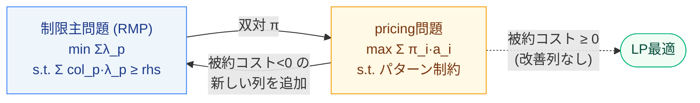
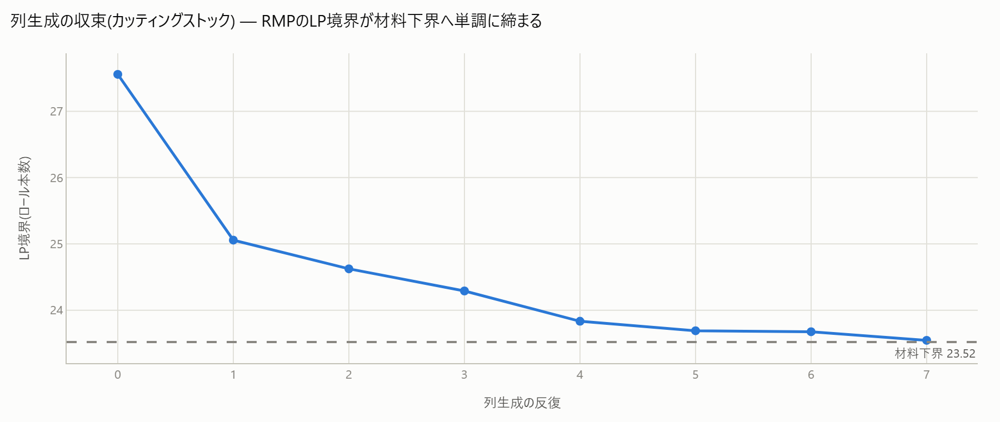

# 6. 列生成(基礎・双対安定化・price-and-branch)

[← プレイブック目次](index.md)

### こんな課題ありませんか

- 「取りうるパターン」(裁断パターン、シフトパターン、経路など)が指数的に多く、
  コンパクトな定式化を**そもそも書き下せない**。
- 列生成という言葉は聞いたことがあるが、実際どう実装すればいいかわからない。

### 診断で何がわかるか

専用の diagnose finding はない(`decomposable` の recipe に選択肢として
`mk.column_generation`/`mk.price_and_branch` が案内される場合はある)。列生成が要る場面は
「モデルがそもそも列挙不能」という規模の問題であり、`analyze` にかける前の設計判断に近い。

## 基礎(Gilmore-Gomory)

制限主問題(現在持っている列だけを使った LP: `min Σλ_p s.t. Σ_p col_p·λ_p ≥ rhs, λ≥0`)を
解いて双対 π を得て、その π のもとで「被約コストが負(価値がある)」列を1本だけ
**pricing問題**(通常はナップサック等の小さな最適化)から生成し、主問題に追加する
――を反復する。**列を全部並べずに、必要な列だけをその都度作る**のが要点(直感的には
「無限にある選択肢を、いま損している方向にだけ一本ずつ問い合わせる」)。



`cutting_stock`: 総パターン131個のうち**13個(9.9%)だけ生成**して最適LP境界23.55に到達し、
8反復で収束する(FINDINGS §3、[`colgen.html`](../gallery/colgen.html))。**正直な知見**: この
LP境界はコンパクト定式化の材料下界(23.52)と**同等**であり、列生成の価値は「LP強度」では
なく「指数的な列を列挙せず暗黙に扱う」こと(実務ではコンパクトが構築不能な規模で効く)。
生成済み列だけを使った制限主問題(整数)は、対称なコンパクト定式化(5231ノード)に対し
**わずか1ノード**で同じ整数最適(24ロール)に到達する。



原理(RMP↔pricing反復)から効果測定までを図付きで追うには
[手法notebook: 列生成](../notebooks/improve/06_column_generation.ipynb) を参照。

## 双対安定化(Wentges)

退化問題では双対 π が反復ごとに大きく振動し(tailing-off)、収束が遅くなる。安定化中心
(最良Farley下界の双対)へ `π̃ = α·π_center + (1−α)·π` で平滑化してから pricing に渡すと
振動が抑えられる。退化 cutting stock(17品目)で反復 **31→25(−19%)**、LP境界382.75は不変
(FINDINGS §3、[`stabilize.html`](../gallery/stabilize.html))。α過大(0.9)は過剰安定化で
未収束になる。

## price-and-branch

列生成後、生成済みの列だけを使って整数制限主問題を解く。**これは上界のみ**(真の整数最適 ≥
この解とは限らない — 正確には整数解 ≥ 真の最適の保証)。厳密な整数最適を保証する
branch-and-price には分枝ノードごとの pricing が要るが、`lp_lb == int_obj` が成り立てば
最適性が(結果的に)証明できる。cutting stock で**整数最適24ロール**(LP下界のceil=24と一致
= 最適性証明済み)([`bnp.html`](../gallery/bnp.html))。

### 効かないとき・注意

- **price_and_branch は最適保証がない**。小規模テスト(W=10, 幅[3,4,5], 需要[3,3,3])で
  `price_and_branch=5` に対し全パターン列挙ILPの真の最適=4 という例がある(FINDINGS §4)。
  `lp_lb == int_obj` を確認しない限り「最適」と言い切らないこと。
- PySCIPOptの `getDualsolLinear` は presolve で制約がNULL化され失敗することがある。
  連続LPの双対取得には scipy `linprog` の `res.ineqlin.marginals` を使う方が確実
  (FINDINGS §4、内部実装済み)。

### 使い方

```python
import minlpkit as mk

widths, rhs, W = [3, 4, 5], [3.0, 3.0, 3.0], 10
init = [[3, 0, 0], [0, 2, 0], [0, 0, 2]]

def pricing(duals):
    from pyscipopt import Model
    kp = Model(); kp.hideOutput()
    a = [kp.addVar(vtype="I", lb=0, name=f"a{i}") for i in range(3)]
    kp.addCons(sum(widths[i] * a[i] for i in range(3)) <= W)
    kp.setObjective(sum(duals[i] * a[i] for i in range(3)), "maximize")
    kp.optimize()
    return [round(kp.getVal(v)) for v in a], kp.getObjVal()

res = mk.column_generation(rhs, init, pricing, alpha=0.0)   # alpha>0 でWentges安定化
bnp = mk.price_and_branch(rhs, init, pricing)                # 整数解(上界)+最適性判定
```

API: [`mk.column_generation`/`mk.price_and_branch`](../api/frameworks.md)。
Worked example: `experiments/run_colgen.py` / `run_stabilize.py` / `run_bnp.py` →
[`colgen.html`](../gallery/colgen.html) / [`stabilize.html`](../gallery/stabilize.html) /
[`bnp.html`](../gallery/bnp.html)。
