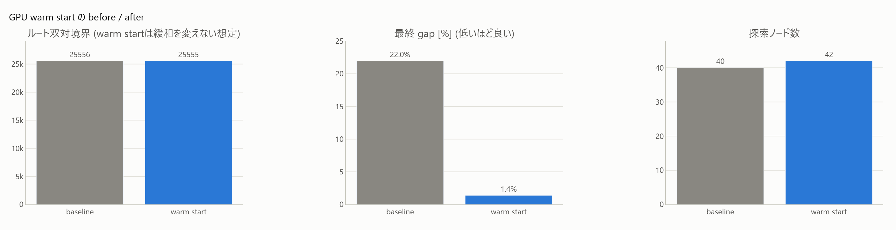

# 7. GPU warm start(cuOpt)

[← プレイブック目次](index.md)

### こんな課題ありませんか

- 数万〜数十万バイナリ変数の大規模MILPで、時間制限内に**可行解すらろくに見つからない**。
- 「CPUの分枝限定は最適性証明に強いが、初期解探索が遅い」と感じている。

### 診断で何がわかるか

`gpu_primal`(warning)は「線形(非線形なし)・バイナリ1万個以上・等式同士の変数共有が
少ない(`eq_overlap ≤ 1.5`)・可行解が少ないかTTFFが遅い・gapが残る」ときに発火する。
**GPU/cuOptの導入有無に関係なく発火する**設計(問題構造だけで判定。「導入価値の提示」
自体が診断の価値、という考え方)。

### 打ち手の仕組み

cuOpt は「GPU上の primal heuristic エンジン + CPU側 B&B」で、B&B・LP自体はCPUで行うが、
Feasibility Jump / Feasibility Pump 系のローカルサーチをGPUで大量並列評価する。
`mk.cuopt_warmstart` はこれを短時間走らせて見つけた解を SCIP に `addSol` で注入してから
通常の `optimize()` に渡す「GPUが可行解探索、CPU(SCIP)が最適性証明」という分業。
`mk.cuopt_concurrent` は cuOpt をバックグラウンドで並走させ、終了し次第イベントハンドラ
経由で mid-solve 注入する(GPU待ちの直列時間をゼロにする)。

### 効果(このリポジトリでの実測)

GAP large(75,000バイナリ、タイト容量、60秒): 純SCIP gap **22.9%**(解3個)に対し、
cuOpt単体 gap **0.64%**、hybrid(cuOpt注入→SCIP)gap **4.72%**(FINDINGS §7。
成果物は `results/gpu/gap_large_compare.html`、リポジトリ内実行時のみ生成される
ローカル成果物のためドキュメントサイトには未同梱)。xlスケール(240,000バイナリ、120秒)
でも優位は持続する: SCIP 20.72% / cuOpt 4.72% / hybrid 7.99%。



原理(warm startがB&Bの枝刈りの出発点をどう変えるか)から適用・効果測定までを図付きで追うには
[手法notebook: GPU warm start](../notebooks/improve/07_gpu_warmstart.ipynb) を参照
(GPUサーバに接続できない環境向けのfallback経路も収録)。

### 効かないとき・注意

- **等式制約が変数を共有する構造(集合分割型)には効かない**。集合分割 large(40,000列)では
  cuOptが**可行解ゼロ**(60秒/180秒とも)。ルートLPが退化して停滞し、GPUヒューリスティクスに
  到達しない。判別子は等式の比率ではなく**等式同士の変数共有度**(`eq_overlap`。GAP=1.0で
  有効、集合分割≈10で不発、閾値1.5)。この構造には[6. 列生成](06-column-generation.md)を
  検討する。
- 小規模(2,000変数)では純SCIPが上(60秒: SCIP gap 0.43% vs cuOpt 1.37%)。GPUは
  「初期可行解が見つかりにくい大規模MILP」に効く技術であって、小規模には出番がない。
- `cuopt_concurrent` はSCIPのルートLPが時間予算を食い尽くす規模(xlクラス)ではイベントが
  発火せず注入機会がゼロになる。その場合は直列の `cuopt_warmstart` を使う
  (使い分けの実測はFINDINGS §7)。
- GPU機能は完全に任意で minlpkit 本体の依存には何も追加しない。未導入環境では
  `mk.cuopt_available()` が False を返し、呼び出すと導入手順つきの `RuntimeError`。

### 使い方

```python
import minlpkit as mk

m = build_model()                          # 最適化前
res = mk.cuopt_warmstart(m, time_limit=15)  # 要 WSL2+cuOpt、または server_url=... でリモート
m.setParam("limits/time", 60)
m.optimize()                                # 注入解を起点にSCIPが証明を続ける
```

API: [`mk.cuopt_warmstart`/`mk.cuopt_concurrent`](../api/live.md)。導入手順・リモートサーバ構成は
[利用マニュアル: GPU設定](../manual/gpu-setup.md)。
Worked example: `experiments/run_gpu_heuristic.py` → `results/gpu/*_compare.html`
(ローカル実行成果物)、`experiments/gpu_dashboard.py`(比較ダッシュボード)。
