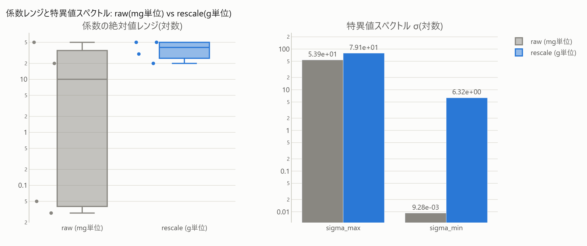

# 8. Condition Number & Numerical Sanity

[← Method Guide Index](index.md)

### Do you have these challenges?

- The solution results differ slightly depending on the execution environment or SCIP version, or "suspicious" numbers appear.
- It is difficult to judge how much of a problem it actually is that the order of coefficients is not aligned.

### What the diagnosis reveals

`numerical_scale` (warning, common with [3. Big-M Elimination](03-bigm.md)) looks at the residual coefficient ratio after presolve (`residual_coef_ratio >= 1e6`). However, this is a max/min ratio and **does not serve as a substitute for the true condition number** (see below).

### Mechanism of the solution

The max/min ratio of coefficients only looks at the "breadth of the range" and is not an accurate indicator of matrix ill-conditioning (the degree of amplification of numerical errors). The true condition number is obtained from the singular value decomposition (SVD) of the coefficient matrix:

$$
\kappa(A) = \frac{\sigma_{\max}(A)}{\sigma_{\min}(A)}
$$

(`matrix_condition`, pre-solve formulation diagnosis). In addition, the condition number of the optimal LP basis when actually solved can be separately measured with `scip_basis_condition` (SCIP's `getCondition()`). These are complementary: the former measures the ill-conditioning of the formulation itself, while the latter measures the "instability of the basis when actually solved".

### Effect (measured in this repository)

With a loose Big-M, $\kappa(A) = 3.5\times10^{4}$; with tightening, $\kappa(A) = 32$ (**the choice of formulation affects numerical sanity by over 100 times**). `unit_commitment` has an extreme LP basis $\kappa \approx 2.6\times10^{11}$, entering the territory where numerical instability risks actually exist (FINDINGS §3b, [`condition.html`](../gallery/condition.html)).



To follow the process with figures, from a demonstration where just changing units (mg -> g) improves $\kappa(A)$ by orders of magnitude, to the actual measurement of SCIP LP basis $\kappa$ in `unit_commitment`, see [Condition Number & Numerical Sanity](../notebooks/improve/08_condition_number.ipynb).

### When it doesn't work / Cautions

- Do not jump to the conclusion that there is a "numerical problem" just from the max/min ratio of coefficients. Natural cost differences (around ~1e3) are not numerical problems, and true ill-conditioning should be seen as ranges of 1e6 or more after presolve (FINDINGS §1).
- The specific solutions to improve the condition number are often "Big-M elimination" ([3. Big-M Elimination](03-bigm.md)) or "tightening variable bounds". The condition number diagnosis itself is **a tool to quantify the symptoms**, and is not a solution on its own.

### How to use

```python
from minlpkit.collectors.static_diag import matrix_condition, scip_basis_condition

kappa_static = matrix_condition(build_model())      # Pre-solve, SVD-based
m = build_model(); m.optimize()
kappa_basis = scip_basis_condition(m)                # Post-solve, SCIP LP basis
```

Worked example: `experiments/run_condition.py` -> [`condition.html`](../gallery/condition.html).
