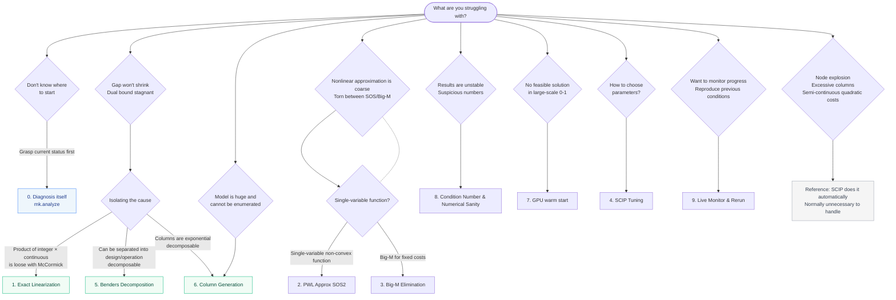

# Method Guide — From Symptoms to Solutions

A guide aimed at **practitioners who "can model (can write formulations in PySCIPOpt) but do not know techniques like column generation, Benders, or reformulations"**. It is designed so that you can trace "What am I struggling with? -> What can I find out? -> How does the solution work? -> How effective is it?", based entirely on **actual numerical measurements** from this repository. Each page is divided into a volume that can be read within 5 minutes.

> As a premise, we repeat minlpkit's design philosophy: **Modern SCIP automatically resolves many textbook improvements via presolve / separation / symmetry handling / reduced cost fixing**. The solutions listed here focus on what SCIP does *not* do automatically (crafting formulations that exploit the weakness of non-convex relaxations, decomposition algorithms), and we also honestly include things where "SCIP does it automatically, little value in interfering" ([Reference: What SCIP Handles Automatically](10-reference-scip-handles.md)).

## Decision Flow (Symptom -> Suspected Cause -> Solution)

First, trace your symptoms through the flow below, and jump to the corresponding page.

## Symptom -> Jump Table

If it is hard to trace through the flow, choose directly from the table below.

| Symptom | Page to Read |
| --- | --- |
| I want to know what the diagnosis actually does | [0. Diagnosis itself](00-diagnose.md) |
| Gap won't shrink / Dual bound is stagnant | [1. Exact Linearization of Integer × Continuous](01-linearize.md) / [5. Benders Decomposition](05-benders.md) / [6. Column Generation](06-column-generation.md) |
| Approximation of nonlinear terms (powers, non-convex functions) is coarse, torn between SOS or Big-M | [2. PWL Approx (SOS2)](02-pwl-sos2.md) / [3. Big-M Elimination](03-bigm.md) |
| Model has become too huge to build/enumerate (patterns are exponential) | [6. Column Generation](06-column-generation.md) |
| Results differ each time solved / numbers are suspicious (rounding errors, unstable basis) | [8. Condition Number & Numerical Sanity](08-condition.md) |
| Feasible solutions cannot be found at all (large-scale 0-1 problem) | [7. GPU warm start](07-gpu.md) |
| Don't know how to choose parameters | [4. SCIP Parameter Tuning](04-tuning.md) |
| Want to stop while watching solve progress / trace later / reproduce same conditions as last time | [9. Live Monitor, Run Recording, and Rerun](09-live-monitor.md) |
| Number of nodes explodes (massive amount of symmetric solutions) | [Reference: Symmetry Breaking](10-reference-scip-handles.md#symmetry) (Normally unnecessary to handle) |
| Massive amount of variables are 0, columns seem "excessive" | [Reference: Reduced Cost Fixing](10-reference-scip-handles.md#redcost) (SCIP default is sufficient) / [6. Column Generation](06-column-generation.md) |
| Want to tighten semi-continuous quadratic costs (on/off × quadratic) | [Reference: Perspective Reformulation](10-reference-scip-handles.md#perspective) (Not recommended for regular use) |

## Full Page List

- [0. Diagnosis itself (analyze/findings/recipe)](00-diagnose.md)
- [1. Exact Linearization of Integer × Continuous](01-linearize.md)
- [2. PWL Approximation (SOS2)](02-pwl-sos2.md)
- [3. Big-M Elimination (tight M・Indicator)](03-bigm.md)
- [4. SCIP Parameter Tuning (Optuna) and Sweep](04-tuning.md)
- [5. Benders Decomposition](05-benders.md)
- [6. Column Generation (Basics, Dual Stabilization, price-and-branch)](06-column-generation.md)
- [7. GPU warm start (cuOpt)](07-gpu.md)
- [8. Condition Number & Numerical Sanity](08-condition.md)
- [9. Live Monitor, Run Recording, and Rerun (rerun)](09-live-monitor.md)
- [Reference: What SCIP Handles Automatically (Symmetry Breaking, Reduced Cost Fixing, Perspective)](10-reference-scip-handles.md)
