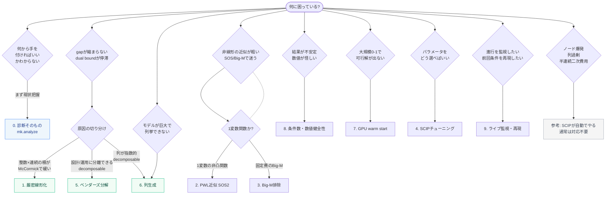

# 手法ガイド — 症状から打ち手へ

**「モデリングはできる(PySCIPOptで定式化を書ける)が、列生成・ベンダーズ・再定式化などの
手法を知らない実務者」**を読者に想定したガイド。「自分は何に困っているのか → 何がわかるのか
→ 打ち手はどういう仕組みか → どのくらい効くのか」を、このリポジトリで**実際に測った数値**
だけを根拠に辿れるようにする。各ページは5分以内で読める分量に区切ってある。

> 前提として繰り返す minlpkit の設計思想: **現代の SCIP は教科書的改善の多くを presolve /
> 分離 / 対称性処理 / 被約コスト固定で自動解消する**。ここに載っている打ち手は、SCIP が
> 自動ではやらないもの(非凸緩和の弱さを突く定式化の作り込み・分解アルゴリズム)を中心に、
> 「SCIPは自動でやる、手を出す価値は薄い」ものも正直に含めている
> ([参考: SCIPが自動でやること](10-reference-scip-handles.md))。

## 決定フロー(症状 → 疑われる原因 → 打ち手)

まず自分の症状を下のフローで辿り、該当するページへ飛ぶ。

## 症状 → ジャンプ表

フローで辿りにくい場合は、下の表から直接選ぶ。

| こんな症状 | 読むページ |
| --- | --- |
| そもそも診断って何をしてくれるのか知りたい | [0. 診断そのもの](00-diagnose.md) |
| gap が縮まらない / dual bound が停滞する | [1. 整数×連続の厳密線形化](01-linearize.md) / [5. ベンダーズ分解](05-benders.md) / [6. 列生成](06-column-generation.md) |
| 非線形項(べき乗・非凸関数)の近似が粗い、SOSやBig-Mで迷っている | [2. PWL近似(SOS2)](02-pwl-sos2.md) / [3. Big-M排除](03-bigm.md) |
| モデルが巨大になって作れない/列挙できない(パターン数が指数的) | [6. 列生成](06-column-generation.md) |
| 解くたびに結果が違う/数値が怪しい(丸め誤差・不安定な基底) | [8. 条件数・数値健全性](08-condition.md) |
| 可行解が全然見つからない(大規模0-1問題) | [7. GPU warm start](07-gpu.md) |
| パラメータをどう選べばいいかわからない | [4. SCIPパラメータチューニング](04-tuning.md) |
| 求解の進み方を見ながら止めたい/後で追いたい/前回と同じ条件で再現したい | [9. ライブ監視・run記録・再現](09-live-monitor.md) |
| ノード数が爆発する(対称な解が大量にある) | [参考: 対称性除去](10-reference-scip-handles.md#symmetry)(通常は対応不要) |
| 変数が大量に0で「列が過剰」に見える | [参考: 被約コスト固定](10-reference-scip-handles.md#redcost)(SCIP既定で十分) / [6. 列生成](06-column-generation.md) |
| 半連続な二次費用(on/off × 二次)を締めたい | [参考: Perspective再定式化](10-reference-scip-handles.md#perspective)(常用非推奨) |

## 全ページ一覧

- [0. 診断そのもの(analyze/findings/recipe)](00-diagnose.md)
- [1. 整数×連続の厳密線形化](01-linearize.md)
- [2. PWL近似(SOS2)](02-pwl-sos2.md)
- [3. Big-M排除(tight M・Indicator)](03-bigm.md)
- [4. SCIPパラメータチューニング(Optuna)とスイープ](04-tuning.md)
- [5. ベンダーズ分解](05-benders.md)
- [6. 列生成(基礎・双対安定化・price-and-branch)](06-column-generation.md)
- [7. GPU warm start(cuOpt)](07-gpu.md)
- [8. 条件数・数値健全性](08-condition.md)
- [9. ライブ監視・run記録・再現(rerun)](09-live-monitor.md)
- [参考: SCIPが自動でやること(対称性除去・被約コスト固定・Perspective)](10-reference-scip-handles.md)
